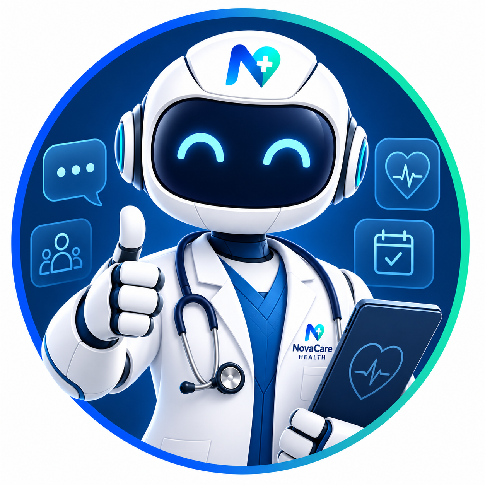

# NovaCare Health

  

**Zendesk AI Deployment — Forward Deployed Engineer (FDE) Technical Exercise**

NovaCare Health is a mid-market healthcare SaaS platform providing electronic health record (EHR) management, patient scheduling, billing, and clinical device support to 400+ healthcare facilities across the United States.

This repository/reference contains the live implementation links for the AI Agent configuration, Action Flow automation, and mock EHR integration built for this exercise.

---

## Overview

| Item | Detail |
|---|---|
| Company | NovaCare Health |
| Platform | Zendesk Suite Enterprise (AI Agents Advanced, Action Builder, ZAF) |
| Source of Truth (simulated) | Epic EHR — FHIR R4 REST API |
| Channels Deployed | Messaging (Chat), Email |
| Core Goal | 70% tier-1 automation rate while preserving HIPAA compliance and patient safety guardrails |

---

## Zendesk Instance

**Admin Center / Base URL:**
[https://novacarehealth-53341.zendesk.com](https://novacarehealth-53341.zendesk.com)

---

## Channels

### 💬 Messaging (Chat)
Live AI Agent widget for real-time, multi-turn conversation flows.

- **Standalone Web Widget:**
  [Launch Messaging Widget](https://static.zdassets.com/agent/assets/react/js/standalone.b9ec7570..html#key=033d7cbc-48f7-48d9-9a55-2737cc8b3ba4&botId=6a63ee9c570692b5fdb7c97b&dir=ltr&locale=en-us&origin=https%3A%2F%2Fnovacarehealth-53341.zendesk.com)
- **Use Case / Intent Configuration:**
  [AI Agent Intents Dashboard (Messaging Bot)](https://novacarehealth-53341.zendesk.com/ai-agents/dashboard/bot/6a63ee9c570692b5fdb7c97b/intents)

### ✉️ Email
Async AI Agent handling generative replies and multi-intent thread resolution.

- **Support Address:**
  support@novacarehealth-53341.zendesk.com
- **Use Case / Intent Configuration:**
  [AI Agent Intents Dashboard (Email Bot)](https://novacarehealth-53341.zendesk.com/ai-agents/dashboard/bot/6a64036ad10316aa0b99c137/intents)

---

## Automation & Integration

### Action Builder
Multi-step workflow automation connecting the AI Agent to the mock Epic EHR system (identity verification → appointment lookup → slot selection → reschedule confirmation → ticket update).

- **Actions:**
  [https://novacarehealth-53341.zendesk.com/admin/apps-integrations/actions/actions](https://novacarehealth-53341.zendesk.com/admin/apps-integrations/actions/actions)
- **Action Flows:**
  [https://novacarehealth-53341.zendesk.com/admin/apps-integrations/actions/action-flows](https://novacarehealth-53341.zendesk.com/admin/apps-integrations/actions/action-flows)

### Mock EHR API
Simulates the Epic EHR system (FHIR R4) — supports identity verification, appointment lookups, available slot retrieval, and rescheduling. Consumed by both the Action Flow and the ZAF sidebar app.

- **Base URL:**
  [https://novacare-health-k67j.onrender.com](https://novacare-health-k67j.onrender.com)

| Method | Endpoint | Purpose |
|---|---|---|
| `POST` | `/verify-identity` | Verifies patient identity via `patient_id` + `date_of_birth` |
| `POST` | `/verify-insurance` | Verifies patient insurance coverage status |
| `GET` | `/patients/:id/appointments` | Returns upcoming appointments |
| `GET` | `/appointments/available-slots` | Returns open rescheduling slots for a date range |
| `PUT` | `/appointments/:id` | Reschedules an appointment |

---

## API Reference (Detailed)

### 🔐 OAuth 2.0 (Mock Authorization Server)

Simulates SMART on FHIR-style authorization so Action Flows and the ZAF app authenticate the same way a real Epic integration would.

| Method | Endpoint | Purpose |
|---|---|---|
| `GET` | `/authorize` | Renders a consent screen for the authorization_code flow (`response_type=code`) |
| `POST` | `/authorize/decision` | Handles Allow/Deny from the consent screen; issues a single-use authorization code and redirects back to `redirect_uri` |
| `POST` | `/token` | Exchanges an authorization code, refresh token, or client credentials for an access token |

**Supported grant types on `/token`:**

| Grant Type | Notes |
|---|---|
| `authorization_code` | Codes are single-use, expire after 5 minutes, and are validated against `redirect_uri` |
| `refresh_token` | Accepts any non-empty refresh token for demo purposes |
| `client_credentials` | Returns an access token directly (no refresh token, per RFC 6749 §4.4) |

**Auth notes:**
- `client_id` / `client_secret` can be passed in the request body or as HTTP Basic Auth.
- All grants return the static demo token `novacare-demo-key-2026` (`Bearer`, 1 hour expiry).
- Demo client credentials: `novacare-demo-client-id` / `novacare-demo-client-secret`.

## Key Constraints Addressed

- **HIPAA / PHI:** No PHI used in AI training data; patient data access is audit-logged; identity verification is required before any EHR lookup.
- **Patient Safety:** Clinical device troubleshooting always escalates to a certified human specialist — the AI Agent never resolves these autonomously.
- **Rate Limits & Auth:** Mock EHR simulates OAuth 2.0 / SMART on FHIR-style access patterns and reflects the 100 req/sec constraint of the production Epic API.
- **Channel Behavior:** Chat is optimized for real-time, structured flows; email supports async, multi-intent resolution with KB article linking.

---

## Quick Reference (Demo Day)

1. Open **Messaging Widget** → walk through a billing, scheduling, and clinical device escalation intent.
2. Open **Email Channel** → show a generative reply resolving a billing FAQ.
3. Open **Action Flows** → walk through the reschedule flow, including at least one error/branch path.
4. Open a test ticket with a populated **Patient ID** field → demo the ZAF sidebar app pulling live data from the **Mock EHR API**.
5. Reference the **Mock API** endpoints to explain integration design decisions.

---

*Prepared for the FDE (AI & Solutions) technical interview — NovaCare Health scenario.*
